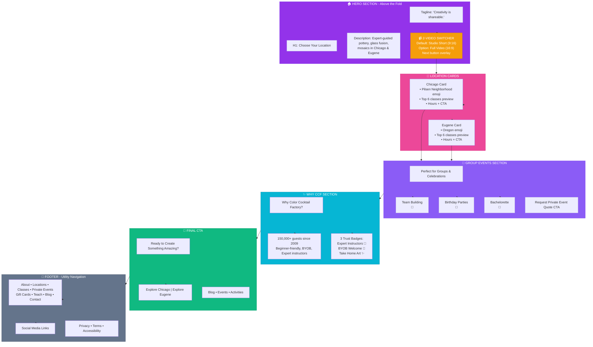

# Color Cocktail Factory - Website Structure Documentation

## Page 1: Site Structure Map

```mermaid
graph TB
    HOME[Homepage<br/>colorcocktailfactory.com<br/>🎯 Location chooser + Brand intro]
    
    %% Top Level Navigation
    HOME --> CHICAGO[Chicago Location Hub<br/>/chicago<br/>📍 SEO landing page]
    HOME --> EUGENE[Eugene Location Hub<br/>/eugene<br/>📍 SEO landing page]
    HOME --> BLOG[Blog<br/>/blog<br/>📝 Content + SEO]
    HOME --> ACTIVITIES[All Activities<br/>/activities<br/>📋 Class catalog]
    HOME --> TEACH[Teach With Us<br/>/teach<br/>💼 Instructor recruitment]
    HOME --> PRIVATE[Private Events<br/>/private-events<br/>🎉 Group bookings]
    HOME --> GIFTS[Gift Cards<br/>/gift-cards<br/>🎁 E-commerce]
    
    %% Chicago Classes
    CHICAGO --> CHI_DATE[Date Night Pottery<br/>/chicago/date-night-wheel<br/>💕 High-converter]
    CHICAGO --> CHI_BEGIN[Beginner Wheel<br/>/chicago/beginner-wheel<br/>🎨 Entry point]
    CHICAGO --> CHI_HAND[Handbuilding<br/>/chicago/handbuilding<br/>🏺 Alternative]
    CHICAGO --> CHI_LAMP[Turkish Lamp<br/>/chicago/turkish-lamp<br/>✨ Premium]
    CHICAGO --> CHI_GLASS[Glass Fusion<br/>/chicago/glass-fusion<br/>🌈 Specialty]
    CHICAGO --> CHI_MOSAIC[Mosaics<br/>/chicago/mosaics<br/>🎨 Craft]
    CHICAGO --> CHI_BONSAI[Bonsai<br/>/chicago/bonsai<br/>🌱 Nature]
    
    %% Eugene Classes
    EUGENE --> EUG_DATE[Date Night Pottery<br/>/eugene/date-night-wheel<br/>💕 High-converter]
    EUGENE --> EUG_BEGIN[Beginner Wheel<br/>/eugene/beginner-wheel<br/>🎨 Entry point]
    EUGENE --> EUG_TERRA[Terrarium<br/>/eugene/terrarium<br/>🌿 Nature]
    EUGENE --> EUG_CANDLE[Candle Making<br/>/eugene/candle-making<br/>🕯️ Craft]
    EUGENE --> EUG_GLASS[Glass Fusion<br/>/eugene/glass-fusion<br/>🌈 Specialty]
    
    %% Private Events Flow
    PRIVATE --> TEAM[Team Building<br/>/team-building<br/>🤝 Corporate]
    PRIVATE --> BIRTHDAY[Birthday Parties<br/>/birthday-parties<br/>🎂 Celebrations]
    PRIVATE --> BACH[Bachelorette<br/>/bachelorette-parties<br/>💍 Groups]
    PRIVATE --> CORP[Corporate Events<br/>/corporate<br/>💼 Business]
    
    %% Blog Section
    BLOG --> BLOG_POST[Blog Posts<br/>/blog/[slug]<br/>📄 SEO content]
    
    %% Teach Section
    TEACH --> TEACH_APPLY[Apply Now<br/>/teach/apply<br/>📝 Application form]
    TEACH --> TEACH_FAQ[Instructor FAQ<br/>/teach/faq<br/>❓ Info]
    TEACH --> TEACH_PAY[Pay & Benefits<br/>/teach/pay<br/>💰 Compensation]
    TEACH --> TEACH_LOGIN[Dashboard<br/>/teach/instructors/dashboard<br/>🔐 Portal]
    
    %% Activities Section
    ACTIVITIES --> ACT_CAT[Activity Detail<br/>/activities/[slug]<br/>📖 Description]
    
    %% Booking Flow
    CHI_DATE -.->|RezClick| REZCLICK[RezClick Calendar<br/>External booking<br/>💳 Conversion]
    EUG_DATE -.->|RezClick| REZCLICK
    
    %% Thank You Pages
    PRIVATE -.->|Form submit| THANKS_PARTY[Thank You<br/>/thanks/private-party<br/>✅ Confirmation]
    TEACH_APPLY -.->|Form submit| THANKS_INST[Thank You<br/>/thanks/instructor-application<br/>✅ Confirmation]
    
    style HOME fill:#9333ea,stroke:#7c3aed,color:#fff
    style CHICAGO fill:#ec4899,stroke:#db2777,color:#fff
    style EUGENE fill:#10b981,stroke:#059669,color:#fff
    style REZCLICK fill:#f59e0b,stroke:#d97706,color:#fff
    style PRIVATE fill:#8b5cf6,stroke:#7c3aed,color:#fff
    
    classDef converter fill:#ef4444,stroke:#dc2626,color:#fff
    classDef seo fill:#3b82f6,stroke:#2563eb,color:#fff
    classDef form fill:#06b6d4,stroke:#0891b2,color:#fff
    
    class CHI_DATE,EUG_DATE converter
    class BLOG_POST,CHICAGO,EUGENE seo
    class TEACH_APPLY,PRIVATE form
```

## Page 2: Homepage Structure (Wireframe)



## Legend

| Symbol | Meaning |
|--------|---------|
| 🎯 | Primary conversion page |
| 📍 | SEO landing page (location-specific) |
| 💕 | High-converting class (date night) |
| 🎨 | Entry-point class (beginner-friendly) |
| ✨ | Premium/specialty offering |
| 📝 | Content/blog page |
| 💳 | External booking (RezClick) |
| 🎉 | Group/private event |
| 💼 | B2B/corporate |
| 🔐 | Gated/login required |
| ✅ | Confirmation/thank you page |
| 📹 | Video/media element |

## Conversion Paths

### Path 1: Individual Class Booking
```
Homepage → Chicago/Eugene Hub → Class Detail → RezClick Calendar → Booking Complete
```

### Path 2: Private Event Inquiry
```
Homepage → Private Events → Form Fill → Thank You → Follow-up Email
```

### Path 3: Gift Card Purchase
```
Homepage → Gift Cards → E-commerce Flow → Purchase Complete
```

### Path 4: Instructor Application
```
Homepage → Teach → Apply → Form Submit → Thank You → HR Review
```

## Mobile vs Desktop Considerations

### Mobile Priority (< 768px)
- Video switcher: Full-width, touch-friendly Next button
- Location cards: Stacked vertically
- Navigation: Hamburger menu
- CTAs: Full-width buttons

### Desktop Priority (≥ 1024px)
- Video switcher: Centered, hover overlay for Next
- Location cards: Side-by-side grid
- Navigation: Full horizontal pill nav
- CTAs: Inline buttons with icons
